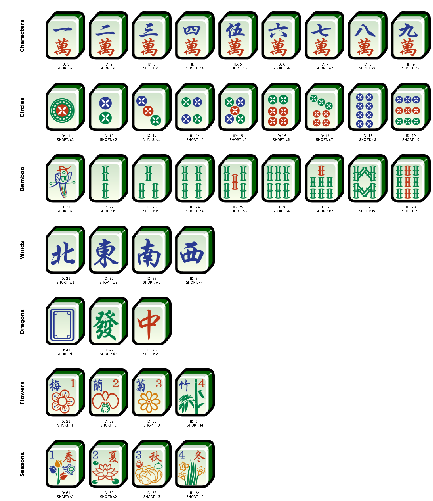

## mahgym

Mahjong built for Analysis

### Mahjong Shorthand Notation:

Action Shorthands

```
Game Flow Markers
"B" | Begin game - B{player} e.g., B0
"E" | End of turn - E{turn} e.g., E1
"L" | Draw game - W0
"M" | Declare win - M{player} e.g., M0

Standard Actions
"D" | Discard - D{player}{tile} e.g., D0n5
"T" | Draw - T{player}{tile} e.g., T3n5

Special Actions
"X" | Reveal Special - X{player}{tile} e.g., X2f1
"H" | Hidden GONG - H{player}{tile} e.g., H0d1
"R" | Robbing GONG - R{player}{tile} e.g., R2c1
Meld Claims
"P" | PUNG - P{player}{tile} e.g., P1n5
"G" | GONG - G{player}{tile} e.g., G2c7
"S" | SEONG - S{player}{meld} e.g., S1b123
```

Tile Shorthands


